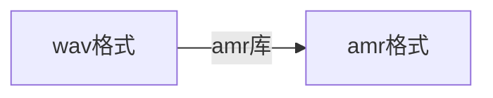
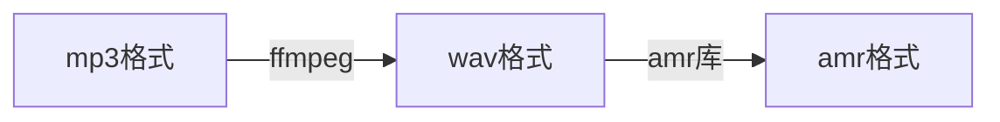

@[TOC](很皮微信)
# 应用展示

# 前景
曾经一直想做一款关于微信的软件,目标就是网上收集很多调皮捣蛋的语音或者录音变声,然后发送给某个微信好友,感觉很有意思
## 开发遇到的难题
 1. 收集很多好玩的语音素材
 2. 录制的音频如何变声
 3. 音频格式转换,微信只支持发送amr格式的音频文件
 4. 如何才能调用微信的发送音频代码
 5. 微信版本升级,如何做到我的软件热更新

这些是我前前后后遇到的所有问题,有很多问题都困扰了我很长时间,在我我不断努力坚持下克服种种困难,终于大功告成了!
### 收集语音素材问题解决
一开始这个问题我很头疼,去哪里找骚里骚气的语音呢?这个问题一度困扰我,一个软件数据才是重要支撑啊,突然有一天刷抖音发现了一个好玩的应用==很皮语音包==,这款APP提供了很多好玩的素材,大家可以下载看一看玩一玩
下载应用瞧了瞧,抓包了下妈了个B,抓不到,应该是app启用了SSL Pinning（又叫“ssl证书绑定“）
使用Xposed+JustTrustMe来突破这个问题[使用方式](https://bbs.pediy.com/thread-226435.htm)可以抓到包了哦但是发现数据是加密的,那就需要知道加密算法了,通过ApkTool反编译很皮语音
我的天加固了...,好吧,看来还得脱壳,脱壳方案[脱壳方案](https://github.com/F8LEFT/FUPK3),脱壳完了终于可以分析了,分析过程就是耐心的过程,为了保护很皮语音加密算法就不公开了,嘿嘿,有素材了,编写个爬虫把数据,保存在数据库中,到这里素材问题解决了

哈哈,好开心,10几W条语音素材了!!!!
### 录制音频如何变声
接下来就是变声功能的开发,QQ很早就出现了变声的功能,但是微信却迟迟不出此功能,我也不知道为啥!!!他不出那我们自己加,首先如何录音呢?作为一个资深andorid开发工程师,这个问题我不解释,录完音如何变声呢?这是个难点,首先我找打了库==SoundTouch==的变声库,集成了下和查询了资料,发现这个可以变声的很少不好,接下来有找到了另外一个库==fmod==尝试的集成了下不错,但是我对音律一窍不通的我,也不知道变声对应调整的参数,没办法只要去抄袭[变音魔术师](http://bbs.zhiyoo.com/thread-9837927-1-1.html),好开心,得到了很多变音的语音素材,并且成功输出了wav的音频文件
### 音频格式转换amr问题(ffmpeg&amr)
#### 音频方面的知识点
这里当时一直不了解如何转换的格式,最后去学习了解了下关于音频的知识,相关知识大家可以自行百度,我这里就总结下我所了解到的
###### 音频文件的组成
我的理解就是,每个音频文件会有一个类似存放音频信息的区域,里面会存放对应音频的编码格式,时间长短,采样率丶声道数丶作者信息等,后面存放的就是经过编码的音频数据数据,有了这个原理,这也就我们能理解到播放器是如何正确的播放不同格式的音频了吧!年轻时候的我还一直天真的以为是通过后缀名呢...现在想想就可笑
###### PCM&WAV的关系
什么是PCM数据呢?我的理解就是没有经过编码的数据,单单就是录制出来的数据,没有通过压缩的数据,这就是传说中的高质量音频,哪pcm和wav又有什么关系呢?其实PCM+WAV的文件头=WAV格式的音频文件,wav格式音频文件是高品质的哦,相对的体积也很大哦
###### 音频格式转换原理
有了上面的音频文件组成的原理,哪我们能不能做一下操作呢?

通过上面的流程是不是就得到了A音频格式->B音频格式的功能
###### 音频参数的理解
 1. ==采样率==指每秒钟取得声音样本的次数。声音其实是一种能量波，因此也有频率和振幅的特征，频率对应于时间轴线，振幅对应于电平轴线。波是无限光滑的，弦线可以看成由无数点组成，由于存储空间是相对有限的，数字编码过程中，必须对弦线的点进行采样
 2. ==采样位数== 采样位数也叫采样大小或量化位数。它是用来衡量声音波动变化的一个参数，也就是声卡的分辨率或可以理解为声卡处理声音的解析度。它的数值越大，分辨率也就越高，录制和回放的声音就越真实。而声卡的位是指声卡在采集和播放声音文件时所使用数字声音信号的二进制位数，声卡的位客观地反映了数字声音信号对输入声音信号描述的准确程度。常见的声卡主要有8位和16位两种，如今市面上所有的主流产品都是16位及以上的声卡
 3. ==通道数== 即声音的通道的数目。常见的单声道和立体声（双声道），现在发展到了四声环绕（四声道）和5.1声道
 4. ==帧== 音频的帧的概念没有视频帧那么清晰，几乎所有视频编码格式都可以简单的认为一帧就是编码后的一副图像。但音频帧跟编码格式相关，它是各个编码标准自己实现的。因为如果以PCM（未经编码的音频数据）来说，它根本就不需要帧的概念，根据采样率和采样精度就可以播放了。比如采样率为44.1kHZ，采样精度为16位的双音频，你可以算出比特率是44100*16*2bps，每秒的音频数据是固定的44100*16*2/8 字节
 5. ==音频计算公式== 数据量 =（采样频率×采样位数×声道数×时间）/8
 
 **为啥要了解这些参数呢?因为我遇到了很大的一个坑,困扰了至少半个月,我每次讲wav的音频转换成amr格式的音频的时候,总出现声音变成的问题,很奇怪,比如4秒的wav转出amr变成了8秒了,这个问题就是采样率造成的,当时我wav的采样率是16000Hz,而amr的采样率是8000Hz,根据上面的公式,这就导致了我声音拉长了2倍(前提其它参数一致哦,解决方案,在录音的时候设置了采样率,ffmpeg格式转换的时候,设置了采样率参数)**
#### 转换格式
对变声音频的输出格式是wav,很皮语音提供素材是MP3格式,而微信需要的格式只支持amr格式,所以需要把素材转换,如何转换呢,使用开源库[ffmpeg](http://ffmpeg.org/),还好支持andord,并且有提供了很多指令,这个库超级强大,支持音频格式转换,而且能操作视频,比如说打水印啊,视频拼接啊,这个库还是很有研究价值的,我这里只用了格式转换,但是发现ffmpeg是不支持转amr个是的,他需要支持库[amr库](https://en.wikipedia.org/wiki/Adaptive_Multi-Rate_audio_codec)
###### wav转amr

###### mp3转amr

格式转换的问题就这样愉快的解决了!
 
## 如何调用微信代码
#### 方案1(微信反编译+回编译+插装代码)
这个方案比较麻烦,第一个问题就是回编译过程中你的微信签名已经变了,这时候就是盗版微信了,这个方案理论上是可行的,我也是完成了这个的开发,但是盗版问题没有任何办法解决,所以相对这个软件此方案放弃

#### 方案2(Xposed框架)
Xposed提供了一套Hook的方案,原理好像是从受精卵赋值进程的时候,会加载对应的框架,但是手机需要相对高的权限,必须要手机root,但是后面开源了[VirtualApp](https://github.com/asLody/VirtualApp),已经可以实现在免ROOT设备上使用Xposed框架了(市面上的分身大师都是基于这个开发),==360分身大师XP版==就具有了这个功能,最重要的是==基于hook并不会改变微信的签名,而且关于后面的热更新方案也带了极大的便利==

## 集成Xposed框架
#### 依赖包
```
dependencies {
//  关键使用compileOnly,这部分代码最终是不打包在apk中的
    compileOnly 'de.robv.android.xposed:api:81'
}
```
#### AndroidManifest.xml配置版本信息
```
    <application
        android:allowBackup="true"
        android:icon="@mipmap/ic_launcher"
        android:label="@string/app_name"
        android:roundIcon="@mipmap/ic_launcher_round"
        android:supportsRtl="true"
        android:theme="@style/AppTheme">
        ........
        <meta-data
            android:name="xposedmodule"
            android:value="true" />

        <!-- 模块描述 -->

        <meta-data
            android:name="xposeddescription"
            android:value="微信WEB辅助插件" />
        <!-- 最低版本号 -->
        <meta-data
            android:name="xposedminversion"
            android:value="46" />
        <meta-data
            android:name="design_width_in_dp"
            android:value="360" />
        <meta-data
            android:name="design_height_in_dp"
            android:value="640" />
    </application>
```
#### 创建Xposed入口类
```
public class XpoInit implements IXposedHookLoadPackage {
    @Override
    public void handleLoadPackage(final XC_LoadPackage.LoadPackageParam loadPackageParam) {
        HookCreate.hookMethod(loadPackageParam);
    }
}
```
#### assets目录创建xposed_init文件
 内容是Xposed入口类,类的全路径昵称
```
com.mm.web.XpoInit
```
#### 寻找微信发送语音代码
这个就需要反编译微信一点一点寻找微信的发送语音过程,然后找到核心方法进行hook调用,这点为了安全还是不公开了,网上很多关于这方面的东西,可以自己去学习了,慢慢根据可以学习[微信开源自动抢红包](https://github.com/aviraxp/WechatLuckyMoney)的源码学习下,慢慢分析也能分析出来

## 插件热修复逻辑
应用开发好了,但是有一个很严重的问题,就是微信版本更新的还是很频繁的,每一版本更新都会从新混淆,哪以前hook的发语音方法,方法名就会发生变化了!每一版都是不一样了,我不可能每次微信更新我都去让用户重新下载一个我的应用重新安装,重启手机,体验太差了,所以必须要有一个热修复的方案
#### DexClassLoader的认识
我们都知道一个类的加载必须要用ClassLoader加载(至少java虚拟机是这么告诉我的),那安卓有没有呢?当然是有的Andorid有2中类加载器PathClassLaoder和DexClassLoader
 1. DexClassLoader可以加载jar/apk/dex，可以从SD卡中加载未安装的apk
 2. PathClassLoader只能加载系统中已经安装过的apk

我们知道Java的类加载器是双亲委托机制的,哪Andord支持吗?答案是:废话,当然支持!是不是根具这个原理,我们可以想办法==当微信启动后,我们加载一个对应版本的dex插件代码就能完成了,并且根据类的委托机制,我们的插件代码可以直接访问微信的类了,根本不需要什么反射的方式调用(其实mutidex,热修复都用了这个东西)==,原理是这么个原理,理论上行得通,就需要用实践来证明

##### 双亲委托机制
根据上面的加载插件方式,我们这里试想下如果微信代码中有一个A类,我们的插件dex中去引用这个A类会不会有问题呢?
理论:
==由于我的dex是自己的DexClassLoader加载的,我寻找A的过程是,先寻找他的父ClassLoader(PathClassLoder),PathClassLoder又回去寻找他的父ClassLoadr(这里已经到了C层了,无需关注了),系统的ClassLoader找不到A,此时PathClassLoaer寻找A类,此时A类就找到了,根据这个过程,我认为我的dex是可以直接引用微信的类的==
#### 如何生成dex插件
如何才能得到一个dex的插件呢?其实dex的文件是通过一个jar转换过来的,首先我们创建一个model项目,项目是一个就是插件的核心代码,我们只需要将此部分代码打包成一个jar包即可,当然达打jar的方法有很多,我推荐自己写一个gradle的task任务,运行就行了

```
// 运行前依赖下build重新构建下
task buildJar(dependsOn: ['build'], type: Jar) {
    archiveName = "mm.jar"
    def srcClassDir = project.buildDir.absolutePath + "/intermediates/classes/release"
    from srcClassDir
    exclude "android*"
    exclude "com/nine/remotemm/JarInterface.class"
    exclude "com/nine/remotemm/BuildConfig.class"
    exclude "com/nine/remotemm/R.class"
    exclude "com/tencent/mm/R\$*"
    exclude "com/tencent/mm/R.class"
    exclude "com/nine/remotemm/R\$*"
}
```
得到jar了,如何将jar包转换成dex,其实Sdk目录下的build-tools/XXX/dx.bat可以通过命令将jar包转出dex文件,当然为了方便我是定task

```
task makeDex(dependsOn: ['makeTestDex'], type: Exec) {
    def jarPath = project.buildDir.absolutePath + "${File.separator}libs${File.separator}hmm.jar"
    def dexPath = project.buildDir.absolutePath + "${File.separator}libs${File.separator}mm.dex"
    if (isWindows()) {
        def dxPath = android.getSdkDirectory().getAbsolutePath() + "${File.separator}build-tools${File.separator}22.0.1${File.separator}dx.bat"
        def cmd = dxPath + " --dex --output=" + dexPath + " " + jarPath
        commandLine 'cmd', '/c', cmd
    } else {
        def dxPath = android.getSdkDirectory().getAbsolutePath() + "${File.separator}build-tools${File.separator}22.0.1${File.separator}dx"
        def cmd = [dxPath, "--dex", "--output=" + dexPath, jarPath]
        commandLine cmd
    }
    standardOutput = new ByteArrayOutputStream()
    ext.output = {
        return standardOutput.toString()
    }
}
```
## 终结
整个流程就是这样的,遇到过很多问题,一步一步解决了问题,开始构建代码,编写后端代码,都花费了很长时间,不过总算是做完了
